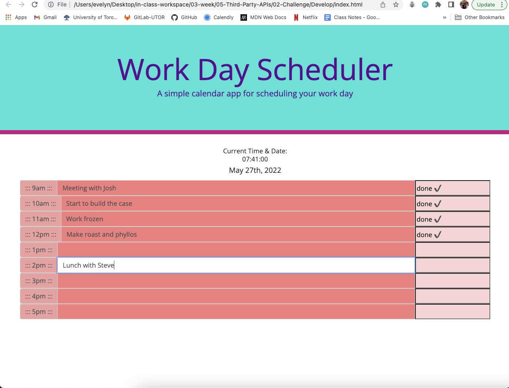

# Third-Party APIs: Work Day Scheduler

## Description
The goal of this project was create a simple calendar application that allows a user to save events for each hour of the day by modifying starter code. This app will run in the browser and feature dynamically updated HTML and CSS powered by jQuery.
I use Moment.js library to work with date and time.

What I was able to accomplish:

- A daily planner to create a schedule.
- When the planner opens, the current day is displayed at the top of the calendar.
- When I scroll down I am presented with timeblocks for standard business hours.
- When I click into a timeblock, I can enter an event.

## Link to the web-site

https://github.com/evelyntorress/redesigned-sniffle.git

## Screenshoot of the web-site

